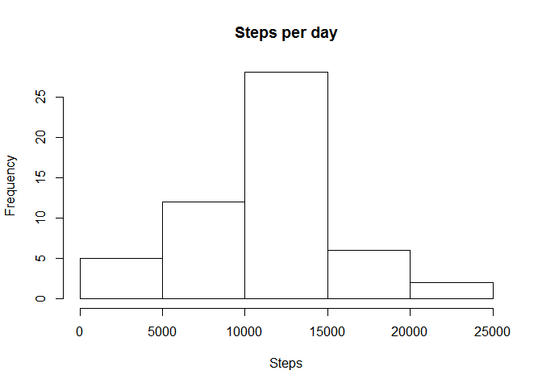
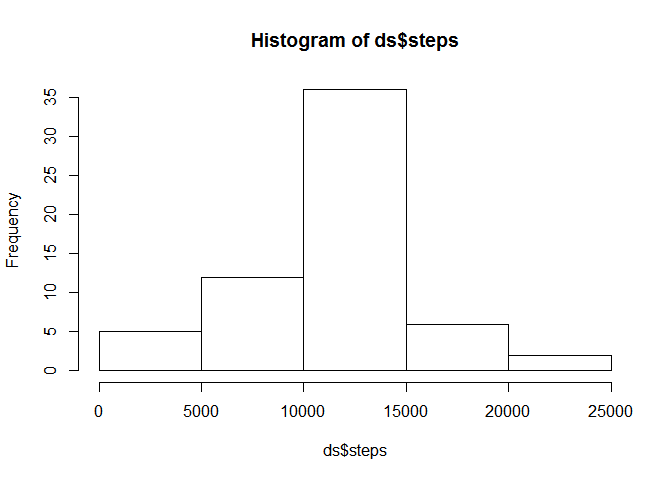

# Reproducible Research: Peer Assessment 1


## Loading and preprocessing the data


```r
unzip("activity.zip")
activity <- read.csv('activity.csv')
```


## What is mean total number of steps taken per day?

1. Sum the total number of steps taken per day

```r
ds <- with(activity, aggregate(steps ~ date, data=activity, sum))
```

2. Graph plot a histogram of the total number of steps taken each day

```r
hist(ds$steps, main="Steps per day", xlab="Steps")
```

<!-- -->

3. Sum and report the mean and median of the total number of steps taken per day

```r
paste("Mean = ", mean(ds$steps))
```

```
## [1] "Mean =  10766.1886792453"
```

```r
paste("Median = ", median(ds$steps))
```

```
## [1] "Median =  10765"
```

## What is the average daily activity pattern?

1. A time base series graph plot of the 5-minute interval (x-axis) and the average number of steps taken, averaged across all days (y-axis)

```r
ds <- aggregate(steps ~ interval, data=activity, mean)
with(ds, plot(interval, steps, type="l"))
```

<!-- -->

2. List of  5-minute interval, on average across all the days in the dataset that contains the maximum number of steps

```r
ds[which.max(ds$steps),]
```

```
##     interval    steps
## 104      835 206.1698
```

## Imputing missing values

1. Sum and report the total number of missing values in the dataset (i.e. the total number of rows with NAs)


```r
sum(is.na(activity))
```

```
## [1] 2304
```

2. Plan a strategy for filling in all of the missing values in the dataset. The strategy does not need to be sophisticated. For example, you could use the mean/median for that day, or the mean for that 5-minute interval, etc.


```r
strategy <- with(activity, tapply(steps, interval, mean, na.rm=TRUE))

activity_na <- subset(activity, is.na(activity))

for(i in 1:nrow(activity_na)){
    column_name <- paste(activity_na[i, "interval"])
    activity_na[i, "steps"] <- strategy[column_name]
}

head(activity_na)
```

```
##       steps       date interval
## 1 1.7169811 2012-10-01        0
## 2 0.3396226 2012-10-01        5
## 3 0.1320755 2012-10-01       10
## 4 0.1509434 2012-10-01       15
## 5 0.0754717 2012-10-01       20
## 6 2.0943396 2012-10-01       25
```

3. Create a new set of data that is equal to the original dataset but with the missing data filled in.


```r
activity_clone <- rbind(activity_na, subset(activity, !is.na(activity)))

head(activity_clone)
```

```
##       steps       date interval
## 1 1.7169811 2012-10-01        0
## 2 0.3396226 2012-10-01        5
## 3 0.1320755 2012-10-01       10
## 4 0.1509434 2012-10-01       15
## 5 0.0754717 2012-10-01       20
## 6 2.0943396 2012-10-01       25
```

4. Graoh plot a histogram of the total number of steps taken each day.


```r
ds <- aggregate(steps ~ date, data=activity_clone, sum)
hist(ds$steps)
```

<!-- -->

Sum and report the mean and median total number of steps taken per day.

```r
c(mean=mean(ds$steps), median=median(ds$steps))
```

```
##     mean   median 
## 10766.19 10766.19
```

Do these values differ from the estimates from the first part of the assignment? What is the impact of imputing missing data on the estimates of the total daily number of steps?

## Are there differences in activity patterns between weekdays and weekends?

1. Create a new factor variable in the dataset with two levels - "weekday" and "weekend" indicating whether a given date is a weekday or weekend day.


```r
is.weekday <- function(x){
    ifelse(weekdays(as.Date(x)) == "Saturday" | weekdays(as.Date(x)) == "Sunday", "weekend", "weekday")
}

activity_clone$hari <- weekdays(as.Date(activity_clone$date))
activity_clone$day <- is.weekday(activity_clone$date)

activity_clone <- transform(activity_clone, day=factor(day))

head(activity_clone)
```

```
##       steps       date interval   hari     day
## 1 1.7169811 2012-10-01        0 Monday weekday
## 2 0.3396226 2012-10-01        5 Monday weekday
## 3 0.1320755 2012-10-01       10 Monday weekday
## 4 0.1509434 2012-10-01       15 Monday weekday
## 5 0.0754717 2012-10-01       20 Monday weekday
## 6 2.0943396 2012-10-01       25 Monday weekday
```

2. Make a panel plot containing a time series plot (i.e. type = "l") of the 5-minute interval (x-axis) and the average number of steps taken, averaged across all weekday days or weekend days (y-axis). The plot should look something like the following, which was creating using simulated data:
